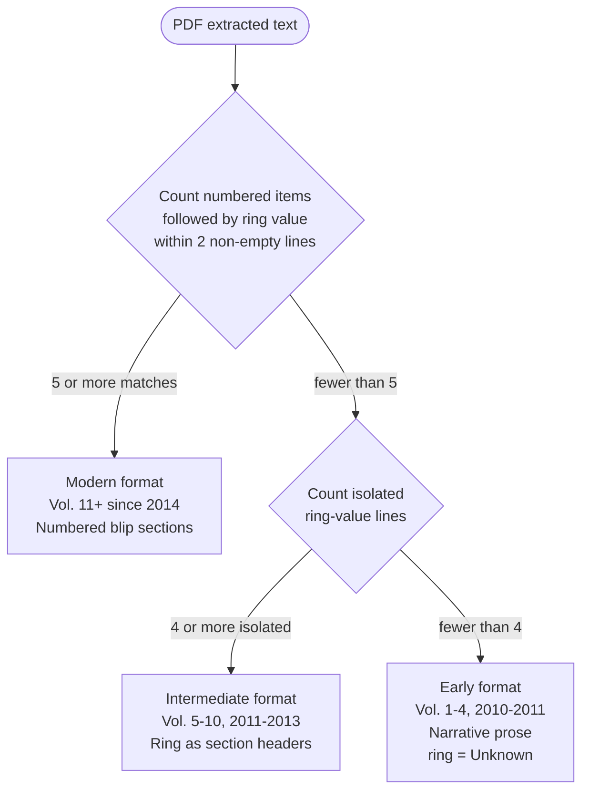
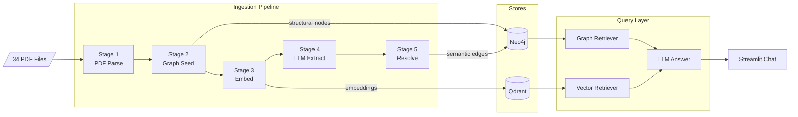
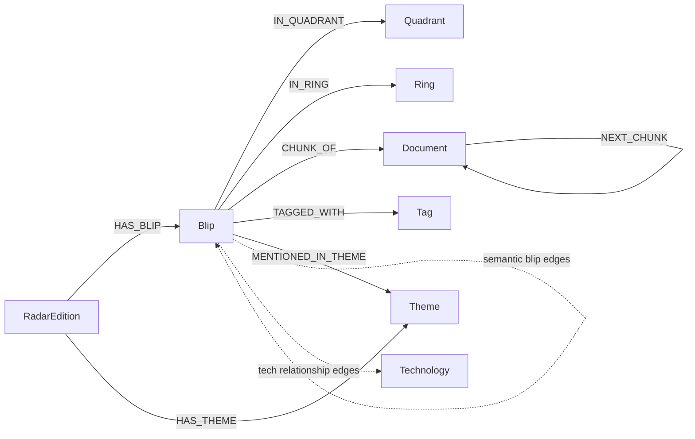
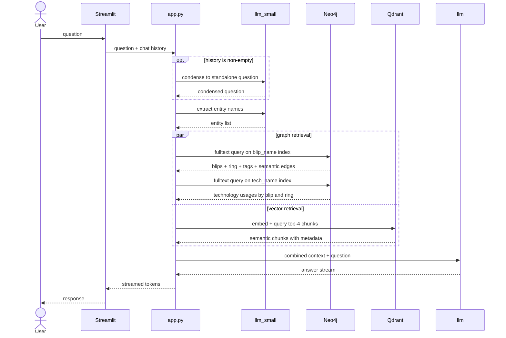

The first obstacle wasn't schema design or LangChain wiring. It was a 2010 PDF where PyPDF scatters blip numbers across the page as floating coordinates because the radar diagram breaks text extraction. You get back a list of integers and names with no reliable connection between them.

I built this to index all 34 editions of the Thoughtworks Technology Radar, from Vol. 1 (January 2010) through Vol. 34 (2026), into a GraphRAG system built on Neo4j and Qdrant. The goal was a chat interface that could answer questions like "what practices should I consider for building an AI customer support agent?" by pulling on 15 years of Thoughtworks technology recommendations. The stack: Python 3.13, LangChain, Neo4j 5.26, Qdrant v1.18, Docker Compose for local infrastructure, and either OpenAI (gpt-4o) or a local Ollama instance (llama3.1:8b) for LLM inference, switchable via a single environment variable.

This is a technical account of building that. The AI parts were not the hard parts.

## Why a knowledge graph?

Plain RAG (formalised in the [2020 Lewis et al. paper](https://arxiv.org/abs/2005.11401)) chunks documents, embeds those chunks, and at query time finds the nearest neighbors to the embedded question. That approach handles "what is continuous delivery?" well. It handles "which Adopt-ring tools warn about observability gaps?" poorly, because cosine similarity has no concept of ring membership, relationship types, or multi-hop traversal. You can ask the question, and the vector store returns chunks that mention rings and observability, but it cannot reason about the structural connection between them.

A knowledge graph adds a structured layer. Nodes represent entities; typed edges represent relationships between them. In Neo4j, node types are called labels (`Blip`, `Ring`, `Quadrant`, `Theme`, etc.) and attributes are properties (`name`, `ring`, `shortSummary`). Relationships also have types (`IN_RING`, `COMPLEMENTS`, `BUILT_ON`) and can carry properties. The schema of allowed node and relationship types is called an ontology; the hierarchical organization of those types is the taxonomy.

Microsoft's [2024 GraphRAG paper](https://arxiv.org/abs/2404.16130) takes this idea further, using LLMs to auto-generate community summaries over the graph for global sensemaking queries across millions of tokens. My use case is narrower: structured traversal over a known, finite domain. The core intuition is the same. For this project the ontology is small and well-understood: eight node types and twelve relationship types. That is deliberate. I am not building a general-purpose knowledge base. The queries I need are specific: "which blips in Adopt complement a practice tagged observability?" and "which blips integrate with Kubernetes, and at what ring?" Those are finite, predictable graph traversals. I looked at RDF/SPARQL briefly and decided the formal ontology machinery was a mismatch for a practical ML engineering project. Neo4j with Cypher, APOC, and the GenAI plugin suited the problem.

There are other approaches to hybrid RAG. I wrote about a [multi-agent RAG system](https://www.burakince.com/post/multi-agent-rag-debugging-second-brain/) that uses BM25 hybrid search with ChromaDB for a different use case (debugging knowledge and incident memory). That approach is simpler to set up and works well when you don't need to traverse typed relationships. The knowledge graph approach requires more engineering but pays off when entity relationships are central to the queries you want to answer, which in the Tech Radar domain they often are.

## Fifteen years of PDF chaos

The Thoughtworks Technology Radar has been published since January 2010. Across 34 editions the PDF layout changed substantially three times, and each layout requires its own parsing strategy.

Format detection is deterministic; no LLM is involved. The parser counts two signals from the extracted text.

A modern-format signal: occurrences of a numbered item (e.g., `17. Canary releases`) followed, within two non-empty lines, by a ring value (`Adopt`, `Trial`, `Assess`, or `Hold`). Five or more such matches means modern format. Modern editions (Vol. 11+, 2014 onward) are cleanly structured with numbered blip sections and the ring value on the next line.

An intermediate-format signal: standalone ring-value lines that are not immediately adjacent to another ring value. The adjacency check is necessary because early editions embed ring names inside the radar diagram image, which PyPDF extracts as a cluster of adjacent ring-name tokens (`Adopt Trial Assess Hold` all on the same line). An intermediate edition (Vol. 5–10, 2011–2013) uses ring names as section headers with all blips in that ring grouped beneath.

If neither signal fires, the PDF is classified as early format.



Early editions are the painful case. The PDF lays out blip numbers and names in a multi-column table of contents page, and when PyPDF hits the radar diagram image, the text extraction fragments. Blip numbers scatter as floating coordinates. The parser gets back something like `1 3 7 2 Evolutionary Database Design Continuous Integration` with numbers and names split and shuffled. Reliable per-blip ring or quadrant assignment from text extraction alone is not achievable.

The fix is a hardcoded lookup table. `_EARLY_BLIP_RANGES` maps each early edition's normalized publication date string to blip number ranges per quadrant:

```python
_EARLY_BLIP_RANGES: dict[str, dict[str, list[tuple[int, int]]]] = {
    "january2010": {  # Vol. 1 — 38 blips
        "Techniques": [(1, 9)],
        "Tools": [(10, 18)],
        "Languages and Frameworks": [(19, 24)],
        "Platforms": [(25, 38)],
    },
    "april2010": {  # Vol. 2 — 59 blips
        "Techniques": [(1, 13)],
        "Tools": [(14, 29)],
        "Languages and Frameworks": [(30, 39)],
        "Platforms": [(40, 59)],
    },
    "august2010": {  # Vol. 3 — 70 blips
        "Techniques": [(1, 17)],
        "Tools": [(18, 35)],
        "Languages and Frameworks": [(36, 46)],
        "Platforms": [(47, 70)],
    },
    "january2011": {  # Vol. 4 — 74 blips
        "Techniques": [(1, 22)],
        "Tools": [(23, 41)],
        "Platforms": [(42, 61)],
        "Languages and Frameworks": [(62, 74)],
    },
}
```

If ToC extraction yields fewer than half the expected blips for an early edition, the parser generates placeholder `BlipMeta` objects from this table with `ring="Unknown"` on all of them. Stage 4 of the pipeline later infers ring values from the description text. It is an ugly solution. The alternative was dropping the four oldest editions entirely.

Theme extraction adds another layer. Vol. 20–21 separate theme titles from body text with lone em-dash lines. Vol. 22–24 have an explicit "Themes for this edition" section header. Vol. 25–34 require a credits-boundary heuristic: locate the credits section, work backward to identify single-line candidate titles, and use spacing gates between candidates to decide what qualifies as a theme versus a sub-heading.

`stage1_parse.py` is 1,441 lines and was the part of this project I rewrote most often.

## A five-stage pipeline that can be interrupted

The ingestion pipeline processes one PDF at a time through five sequential stages, each checkpointed independently so an interruption resumes from the last completed stage rather than from the beginning.



After each stage completes for a given file, `pipeline_checkpoint.json` records a boolean flag keyed as `"{file_key}.s{stage}"`. Serialized `RadarMeta` and `BlipSemantics` are also cached in the checkpoint so subsequent stages can load them without re-parsing or re-calling the LLM. The `--stage N` CLI flag clears the checkpoint for a specific stage and all later ones across all files, forcing a re-run from that point.

**Stage 1** extracts structural metadata from the PDF: blip number, name, ring, quadrant, description. No LLM is involved. These facts are printed in the document; using a language model to extract them would add cost, latency, and hallucination risk for information that regex handles without ambiguity. The output is a `RadarMeta` Pydantic model with a list of `BlipMeta` objects. `RadarMeta` computes a stable `edition_id` property (`radar-vol-5`, `radar-jan-2010`) used as the Neo4j `RadarEdition` node ID across all subsequent stages.

**Stage 2** seeds the knowledge graph. Every write uses `MERGE` on unique constraints, making the stage fully idempotent: running it twice produces the same graph. Eight node labels get unique constraints applied before the file loop starts. Blip IDs are edition-scoped (`{edition_id}-blip-{number}`) to prevent collisions between blips with the same sequential number across different editions. `IN_RING` edges are skipped when `ring="Unknown"` (early editions); the `UnknownCollector` records each skip.

**Stage 3** chunks blip descriptions at blank lines, merging short adjacent paragraphs up to 300 words (a whitespace-split approximation, fast enough for this use case). Chunks embed in batches of 32. When the embedding API returns HTTP 431 (request too large), the batch halves automatically and retries. Qdrant point IDs use `uuid5(NAMESPACE_DNS, doc_id)` for deterministic, idempotent upserts. Stage 3 also creates `Document` nodes in Neo4j with `CHUNK_OF` edges back to their parent `Blip` or `Theme`, and `NEXT_CHUNK` edges forming a linked list of chunks within each blip.

**Stage 4** is the most expensive. One structured output call to `llm_small` (gpt-4o-mini or llama3.2:3b) extracts a `BlipSemantics` object per blip. The small model keeps ingestion costs low; entity extraction and relationship classification don't require the full model. All blip calls for an edition run concurrently under `asyncio.Semaphore(2)` via `asyncio.gather()`, with tenacity handling retries at exponential backoff (2–60 seconds, 4 attempts).

What makes Stage 4 actually work is enforcing the relationship vocabulary at the type level:

```python
BlipRelType = Literal[
    "COMPLEMENTS",
    "REFERENCES",
    "WARNS_ABOUT",
    "MITIGATES",
    "ALTERNATIVE_TO",
    "PART_OF_ECOSYSTEM",
]

class BlipRelation(BaseModel):
    name: str
    relationship: BlipRelType
```

Without this, the LLM invents relationship type names (`"USES"`, `"DEPENDS_ON"`, `"COMPATIBLE_WITH"`) that don't correspond to Neo4j edge types. The `Literal` type in Pydantic v2 structured output restricts the model to exactly those six strings. The same pattern applies to `TechRelType` (four types for blip-to-technology edges) and the 25-item `VALID_TAGS` closed list. `BlipSemantics` also carries `ring_inference`: when `ring="Unknown"`, the LLM reads the description language and infers the ring value ("we recommend" → Adopt, "worth exploring" → Assess, "we advise against" → Hold).

**Stage 5** resolves the LLM's blip name references to actual blip IDs. The LLM in Stage 4 names blips by their text label, and those names sometimes have minor variations or typos. Stage 5 first tries an exact case-insensitive match; if that fails, it uses `difflib.get_close_matches()` with a 0.7 similarity cutoff. Resolved references become Neo4j edges via `MERGE`. Ring inference from Stage 4 is applied here: early-edition blips get their `ring` property updated and the missing `IN_RING` edge created. `shortSummary` is written to each `Blip` node.


## The knowledge graph schema

After all five stages run across all 34 editions, the graph contains eight node types connected by twelve relationship types.



Solid edges are structural, created deterministically in Stages 2 and 3. Dashed edges are semantic, created by the LLM in Stage 4 and resolved in Stage 5. The six blip-to-blip semantic relationship types are `COMPLEMENTS`, `REFERENCES`, `WARNS_ABOUT`, `MITIGATES`, `ALTERNATIVE_TO`, and `PART_OF_ECOSYSTEM`. The four blip-to-technology types are `INTEGRATES_WITH`, `BUILT_ON`, `RUNS_ON`, and `ALTERNATIVE_TO`. `Ring.weight` (Adopt=3, Trial=2, Assess=1, Hold=0) encodes canonical ring ordering as a numeric property so Cypher queries can sort without string comparison.

A multi-hop query illustrating what the graph structure enables: finding Adopt-ring blips that complement an observability-tagged blip.

```cypher
MATCH (b:Blip)-[:TAGGED_WITH]->(:Tag {name: "observability"})
WITH collect(b) AS obs_blips
MATCH (a:Blip)-[:IN_RING]->(:Ring {name: "Adopt"})
WHERE any(ob IN obs_blips WHERE (a)-[:COMPLEMENTS]->(ob))
RETURN a.name, a.shortSummary
```

That query requires knowing which blips are tagged observability, which other blips explicitly complement them, and what ring those complementing blips are in. Three traversal hops, all typed. Vector similarity alone cannot express it.


## Asking questions across fifteen years of data

At query time, the application runs a graph retriever and a vector retriever, combines their output, and passes the combined context to the large LLM for a final answer.



The graph retriever starts by asking `llm_small` to extract entity names from the question using structured output:

```python
class Entities(BaseModel):
    names: List[str] = Field(
        description="Technology tools, frameworks, languages, practices, or platforms "
                    "mentioned in the text"
    )

entity_chain = _entity_prompt | llm_small.with_structured_output(Entities)
```

For each entity name, the retriever builds a fuzzy Lucene query and hits two Neo4j fulltext indexes. The fuzzy matching handles abbreviations and near-typos:

```python
def _generate_fulltext_query(text: str) -> str:
    words = [w for w in remove_lucene_chars(text).split() if w]
    return " AND ".join(f"{w}~2" for w in words)
```

The `~2` suffix tells Lucene to allow edit distance 2 per word. `remove_lucene_chars` strips characters Lucene treats as operators, preventing query injection. Two indexes get queried: `blip_name` (on `Blip.name` and `Blip.shortSummary`) returns ring, quadrant, domain tags, and semantic edge traversals in a single Cypher call. `tech_name` (on `Technology.name`) returns which blips reference a given technology and at which ring.

The vector retriever embeds the question and queries Qdrant for the four nearest chunks. Each point's payload includes `blipName`, `ring`, `quadrant`, and `text`, so the formatted result carries provenance alongside the chunk text rather than returning raw text.


Chat history is handled by a `RunnableBranch`. When history is present, `llm_small` condenses it and the follow-up question into a standalone question before retrieval runs. When there is no history, the question passes through unchanged. The large model always handles the final answer:

```python
_search_query = RunnableBranch(
    (
        RunnableLambda(lambda x: bool(x.get("chat_history"))),
        RunnablePassthrough.assign(
            chat_history=lambda x: _format_chat_history(x["chat_history"])
        )
        | CONDENSE_QUESTION_PROMPT
        | llm_small
        | StrOutputParser(),
    ),
    RunnableLambda(lambda x: x["question"]),
)

chain = (
    RunnableParallel({"context": _search_query | retriever, "question": RunnablePassthrough()})
    | answer_prompt
    | llm
    | StrOutputParser()
)
```

The two-tier LLM split is an intentional cost/quality trade-off. `llm_small` handles entity extraction and question condensation, tasks where a smaller model is more than sufficient and where cost accumulates across many queries. `llm` handles the final answer where reasoning quality and grounding matter.


## Knowing what you don't know

Every stage accepts an optional `UnknownCollector` instance. When the parser encounters ambiguous data (a blip with no detectable ring, a theme name that doesn't match any known themes, a blip reference from Stage 4 that Stage 5 can't resolve), it calls `collector.record(stage, event_type, **details)`. The collector buffers records in memory and flushes them as newline-delimited JSON to `pipeline_unknowns.jsonl` at the end of processing each PDF, even if the pipeline fails partway through.

```python
class UnknownCollector:
    def record(self, stage: int, kind: str, **details: Any) -> None:
        self._records.append({
            "timestamp": datetime.now(timezone.utc).isoformat(),
            "pdf_file": self._pdf_file,
            "stage": stage,
            "type": kind,
            **details,
        })

    def flush(self) -> None:
        if not self._records:
            return
        with UNKNOWNS_FILE.open("a", encoding="utf-8") as fh:
            fh.write("\n".join(json.dumps(r) for r in self._records) + "\n")
```

Across 34 PDFs, the log captures every case where the pipeline fell back to placeholder data, every unresolved blip name reference, every ring inference the validator rejected. It gives a complete data quality audit without interrupting the pipeline. Querying it afterward shows exactly how much of the early-edition data is inferred versus parsed from source.


## What actually worked

The best decision I made was parsing structural facts deterministically and using the LLM only for semantic extraction. Blip number, name, ring, quadrant: these are printed in the PDF. Using a language model to extract them would cost tokens, add retry complexity, and introduce hallucination risk for information that regex handles without ambiguity. The LLM's job is extracting things that are not expressed as structured data: relationship types between blips, external technology mentions, domain tags, and ring values for early editions where the ring isn't stated per blip.

Pydantic `Literal` types for the LLM's output vocabulary mattered more than I expected. The first version of `BlipSemantics` used plain `str` for relationship types, and the model reliably generated `"USES"`, `"DEPENDS_ON"`, `"COMPATIBLE_WITH"`: syntactically valid strings, but none of them match any Neo4j edge type. Switching to `BlipRelType = Literal["COMPLEMENTS", "REFERENCES", ...]` fixed the problem entirely. The structured output schema doubles as a constraint that the model sees and respects.

PDF parsing across 15 years of format changes is harder than it looks. I expected two layout variations; I found three distinct formats and multiple sub-variations within each. The `_EARLY_BLIP_RANGES` hardcoded table is the ugliest code in the project. For a production data pipeline I would invest in a human-verified metadata dataset for the early editions. For this project, the fallback gets the job done.

Checkpointing at each stage changed how the pipeline behaves under failure. Before adding it, a network error during Stage 4 on edition 27 of 34 meant starting over from the beginning. After, the same interruption resumes from Stage 4 on edition 27. When I was iterating on Stage 5 fuzzy matching logic, I wiped just the Stage 5 checkpoint for all files and re-ran without touching the embedding or LLM extraction work. That kind of resumability is standard in production data pipelines. It doesn't arrive for free; it required explicit design here.

Hybrid retrieval performs noticeably better than either method alone, a finding [HybridRAG (2024)](https://arxiv.org/abs/2408.04948) confirms across different domains. The graph retriever catches precise entity relationships that vector search misses, particularly multi-hop queries. The vector retriever catches thematic similarity that fulltext graph queries miss, particularly when the user's question uses vocabulary that doesn't map directly to blip names. The final LLM model gets enough signal from the combined context for specific, grounded answers.

Running against local Ollama during development and OpenAI in production, through the same code path, worked well. Most development iteration happened against llama3.1:8b and nomic-embed-text on a homelab machine at zero API cost. The same pipeline code and query application work with OpenAI by setting `LLM_PROVIDER=openai`. The only code difference is embedding dimension (768 vs 1536), handled by a property on the `Settings` model.

If I were starting over, I would characterize all 34 PDFs up front before writing a single parsing function. I built the modern parser first, added intermediate support when I noticed wrong results on 2011–2013 editions, and handled early editions after four PDFs produced empty blip lists. A proper upfront survey would have surfaced all three format types before any code was written, and I would have designed the detection logic and fallback mechanisms from the beginning rather than retrofitting them.

## Further reading

**RAG and GraphRAG foundations**

- [Retrieval-Augmented Generation for Knowledge-Intensive NLP Tasks](https://arxiv.org/abs/2005.11401): Lewis et al. (2020), the paper that introduced RAG as a pattern for grounding LLM outputs in retrieved documents
- [From Local to Global: A Graph RAG Approach to Query-Focused Summarization](https://arxiv.org/abs/2404.16130): Edge et al. (2024), Microsoft's GraphRAG using LLM-generated community summaries for global sensemaking over large corpora
- [HybridRAG: Integrating Knowledge Graphs and Vector Retrieval Augmented Generation for Efficient Information Extraction](https://arxiv.org/abs/2408.04948): empirical comparison showing hybrid graph + vector retrieval outperforms either approach alone

**Knowledge graph + LLM tooling**

- [Create a Neo4j GraphRAG Workflow Using LangChain and LangGraph](https://neo4j.com/blog/developer/neo4j-graphrag-workflow-langchain-langgraph/): Neo4j's official guide combining graph queries, vector search, and LangGraph for agentic RAG workflows
- [Enhancing RAG-based Application Accuracy by Constructing and Leveraging Knowledge Graphs](https://www.langchain.com/blog/enhancing-rag-based-applications-accuracy-by-constructing-and-leveraging-knowledge-graphs): LangChain's introduction to their graph construction modules and how graph queries complement vector retrieval

**PDF parsing**

- [A Comparative Study of PDF Parsing Tools Across Diverse Document Categories](https://arxiv.org/abs/2410.09871): October 2024 benchmark of PyPDF, PDFMiner, and others across scientific, financial, and general documents, with failure mode analysis
