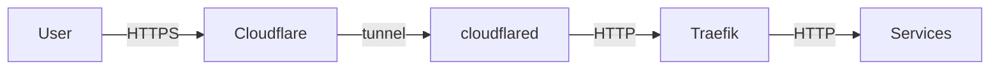

One day I logged into Auth0 and my tenant was gone. Not locked. Not suspended. Gone.

I reached out to Auth0 support. The reply came back: the tenant had been deactivated for inactivity. Free-tier tenants get deleted automatically after 150 days without a login. No email warning before it happens. I'd built a handful of OIDC integrations for homelab services on that tenant, and they all stopped working overnight.

The obvious fix would be to create a new Auth0 account and be more attentive. But I'd wanted to move off it for a while, and this felt like a reasonable forcing function.

The config examples below are representative of the pattern, not a literal dump of my cluster. Service names, vault paths, and hostnames are illustrative so you can adapt them to your own setup.

## Why Authentik

I looked at Keycloak, Zitadel, and Authentik. Keycloak is the enterprise standard and felt like too much for a homelab. Zitadel is newer and interesting but its Helm chart is more involved than I wanted at the time. Authentik has a clean admin UI, a maintained Helm chart, and a sane approach to flows and providers.

The other thing: no usage caps. Once it's running, my data stays on my cluster. If I disappear for six months, nothing gets quietly deleted.

## My stack

Quick overview of what's running:

- Kubernetes (an older cluster, upgrade is on the list)
- Traefik as the ingress controller
- ArgoCD for GitOps deployments
- 1Password operator for secrets management
- cloudflared for the Cloudflare Tunnel

Cloudflare Access sits in front of most of my subdomains. It intercepts unauthenticated requests and redirects to an OIDC provider before letting traffic through.

## The architecture, and a chicken-and-egg problem

Traffic flows like this:



cloudflared handles public TLS termination. Inside the tunnel, traffic goes from cloudflared to Traefik over plain HTTP on port 80, then Traefik forwards to Authentik. No self-signed cert complications, because internal traffic never touches the public internet.

There's a bootstrapping problem with this setup. Cloudflare Access works by redirecting unauthenticated users to an OIDC provider. That provider has to be reachable. If I put `auth.example.com` behind Cloudflare Access, nobody can ever authenticate: the access check redirects to the auth server, which is also behind the access check, which redirects to the auth server.

So `auth.example.com` is the one subdomain that stays publicly accessible. Everything else goes through Access.

## Deploying Authentik

### Namespace

```yaml
apiVersion: v1
kind: Namespace
metadata:
  name: authentik
```

### Secrets via the 1Password operator

I use the 1Password operator to inject secrets without putting anything sensitive in git. The operator watches `OnePasswordItem` resources and creates Kubernetes secrets from 1Password vault entries:

```yaml
apiVersion: onepassword.com/v1
kind: OnePasswordItem
metadata:
  name: authentik-secrets
  namespace: authentik
spec:
  itemPath: "vaults/<your-vault>/items/<your-item>"
```

The item in 1Password holds `AUTHENTIK_SECRET_KEY`, `AUTHENTIK_POSTGRESQL__USER`, and `AUTHENTIK_POSTGRESQL__PASSWORD`. The Helm chart picks these up via `existingSecret`.


### The Traefik middleware (save yourself some time and do this first)

This was the actual fix for the most frustrating problem I hit. Authentik checks `X-Forwarded-Proto` to decide whether the connection is HTTPS. When cloudflared terminates TLS and sends plain HTTP to Traefik, that header is either absent or set to `http`. Authentik sees a non-HTTPS connection and its interceptors fail.

The fix is a Traefik middleware that injects the right header:

```yaml
apiVersion: traefik.containo.us/v1alpha1
kind: Middleware
metadata:
  name: authentik-headers
  namespace: authentik
spec:
  headers:
    customRequestHeaders:
      X-Forwarded-Proto: "https"
```

Apply this before you start debugging Authentik logs.

Once deployed, Traefik's dashboard shows the middleware registered and healthy:


### The ArgoCD Application

```yaml
apiVersion: argoproj.io/v1alpha1
kind: Application
metadata:
  name: authentik
  namespace: argocd
spec:
  destination:
    name: ""
    namespace: authentik
    server: "https://kubernetes.default.svc"
  source:
    path: ""
    repoURL: "https://charts.goauthentik.io"
    targetRevision: x
    chart: authentik
    helm:
      values: |
        global:
          env:
            - name: AUTHENTIK_POSTGRESQL__HOST
              value: postgres.<namespace>.svc.cluster.local
            - name: AUTHENTIK_LOG_LEVEL
              value: error
        authentik:
          log_level: error
          existingSecret:
            secretName: authentik-secrets
          error_reporting:
            enabled: false
        server:
          enabled: true
          ingress:
            ingressClassName: traefik
            annotations:
              traefik.ingress.kubernetes.io/router.entrypoints: web
              traefik.ingress.kubernetes.io/router.middlewares: authentik-authentik-headers@kubernetescrd
            enabled: true
            hosts:
              - auth.example.com
            https: false
          nodeSelector:
            node-role.kubernetes.io/worker: "true"
        worker:
          enabled: true
          nodeSelector:
            node-role.kubernetes.io/worker: "true"
  sources: []
  project: default
  syncPolicy:
    automated:
      prune: true
      selfHeal: false
    syncOptions:
      - CreateNamespace=true
```

A few things worth noting:

`AUTHENTIK_POSTGRESQL__HOST` points to an existing PostgreSQL service running elsewhere in the cluster. Authentik requires an external database; substitute your own service DNS name here.

`existingSecret.secretName: authentik-secrets` tells the chart to use the secret the 1Password operator created.

`https: false` on the ingress is intentional. Traefik receives plain HTTP from cloudflared on port 80.

The middleware reference `authentik-authentik-headers@kubernetescrd` follows Traefik's namespace-prefixed naming for CRD-based middleware. The format is `<namespace>-<middleware-name>@kubernetescrd`.

## Configuring Cloudflare Access as an OIDC relying party

In Authentik, create an OAuth2/OIDC provider first, then create an application pointing to it.

The authorization flow matters here. Set it to `default-provider-authorization-implicit-consent`. The explicit flow only works for internal Authentik users who can respond to the consent screen interactively. Cloudflare Access won't see the consent redirect as a successful authentication, so everyone gets rejected.

In the Cloudflare Zero Trust dashboard, go to Settings > Authentication > Add new and choose OIDC. The fields:

- **OpenID Configuration URL**: `https://auth.example.com/application/o/<your-app-slug>/.well-known/openid-configuration`
- **Authorize URL**: `https://auth.example.com/application/o/authorize/`
- **Token URL**: `https://auth.example.com/application/o/token/`
- **JWKS URL**: `https://auth.example.com/application/o/<your-app-slug>/jwks/`
- **OIDC Scopes**: `openid`, `email`, `profile`
- **OIDC Claims**: `groups`

Once saved, Authentik appears in the identity providers list:


The `groups` claim goes in **OIDC Claims**, not OIDC Scopes. OIDC Claims tells Cloudflare Access to pull that claim out of the JWT Authentik issues.


## Getting groups to work

Cloudflare Access can base policies on group membership rather than hardcoded email addresses. It's worth the extra setup: adding someone to an Authentik group grants them access to everything protected by that group's policy, without touching any Cloudflare config.

It takes two steps.

**Part one: the Authentik Property Mapping**

In Authentik, go to Customization > Property Mappings and create a new Scope Mapping.


Set the scope name to `groups`. The expression:

```python
return list(request.user.ak_groups.values_list("name", flat=True))
```


Add this mapping to your OAuth2 provider under "Scopes". This is what puts group names into the JWT Authentik issues.

**Part two: Cloudflare Access reads it via OIDC Claims**

With the property mapping in place, Authentik includes a `groups` array in the token. Setting `groups` in the Cloudflare OIDC Claims field (not Scopes) tells Cloudflare Access to extract that claim and make it available for policy rules.

Once this is working, access control lives entirely in Authentik. The groups list in Authentik shows exactly who has access to what:


In Cloudflare Access, policies can then match on the `groups` OIDC claim. For example, requiring claim name `groups` with value `homelab` restricts a protected application to members of that group:


Add someone to the `homelab` group in Authentik and they can reach all subdomains protected by that rule, no Cloudflare config changes needed.

## The wrong turns

I kept notes on what didn't work.

**`AUTHENTIK_LISTEN__TRUSTED_PROXY_CIDRS`**: I added this env var thinking I needed to explicitly tell Authentik to trust the Traefik proxy. The private CIDR ranges are already in the defaults. Setting it explicitly did nothing.

**`AUTHENTIK_HOST` and `AUTHENTIK_HOST_BROWSER`**: Found these in a blog post somewhere, added them to the config. They don't exist in the official Authentik docs. Authentik silently ignores them (or they have no effect). Spent a while convinced they were helping before I checked the actual docs.

**`AUTHENTIK_COOKIE_DOMAIN`**: Added it. Didn't need it. Removed it.

**WebSocket headers in the middleware**: I added `Upgrade: WebSocket` and `Connection: Upgrade` to the Traefik middleware, thinking Authentik's WebSocket connections needed a hand through the proxy. Traefik handles WebSocket upgrades automatically. Adding those headers manually breaks regular HTTP requests. Took me longer than I'd like to admit to connect the dots between "I fixed the middleware" and "certain things are now broken."

**`router.tls: "true"` annotation on the ingress**: This caused 404s across the board. The annotation tells Traefik to use the TLS entrypoint, which listens on port 443. cloudflared sends plain HTTP to Traefik on port 80. Nothing is listening for that request on 443 in this setup.

**`goauthentik.io/api` scope**: Added it to the OIDC scopes list, thinking Cloudflare Access might need API access to Authentik. It doesn't. The OIDC Scopes field in Cloudflare only needs `openid`, `email`, and `profile`. The `groups` claim comes through the Authentik property mapping and is read by Cloudflare via OIDC Claims, not Scopes.

## What's next

The setup is working. Authentik is running, Cloudflare Access policies use group membership from Authentik, and the only config change needed to grant or revoke someone's homelab access is editing their groups in the Authentik admin UI.

The cluster is running an older Kubernetes version and the upgrade is overdue. Let's Encrypt for internal TLS is also on the list, though with cloudflared handling public TLS it's not urgent given that internal traffic stays inside the cluster. One thing at a time.
