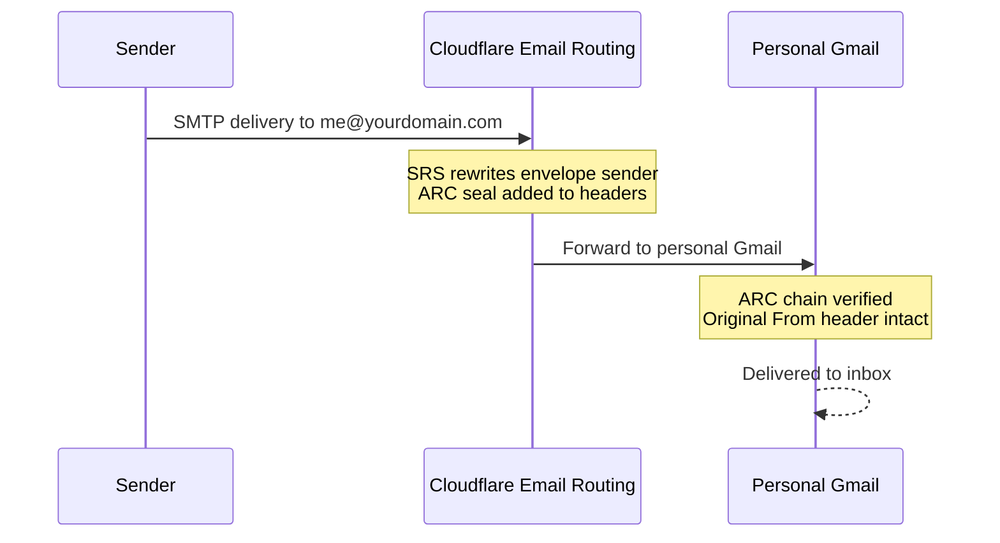
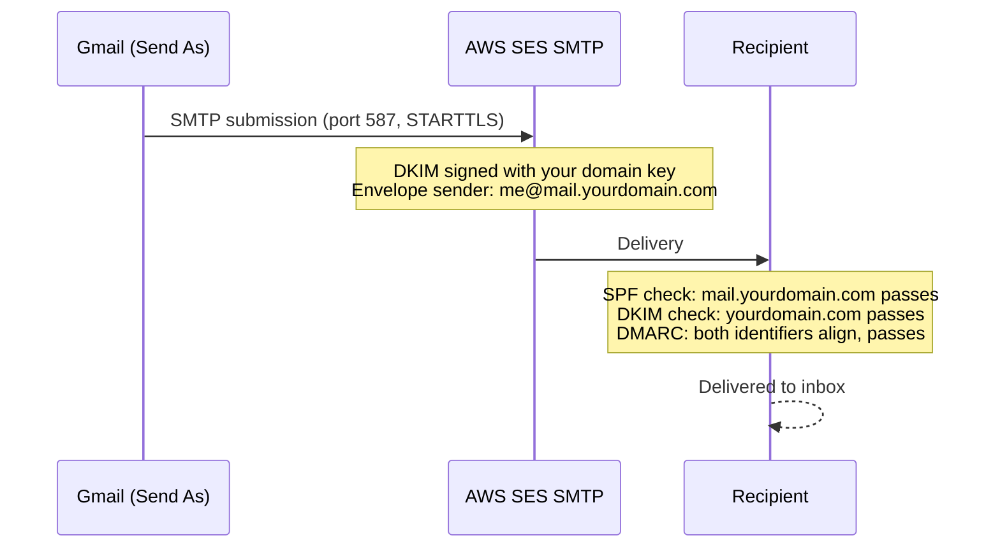
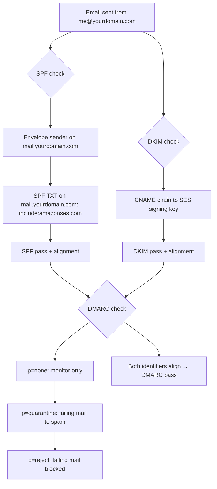

I have been paying for Google Workspace for years. One account. One person. One domain. Every month I would see that charge and think: there has to be a better way.

There is. I now send and receive email at `me@yourdomain.com` through Gmail, with SPF, DKIM, and DMARC all passing, for essentially nothing. The only real cost is the domain itself, something I was paying for anyway. This post walks through exactly how I set it up, including the parts the official docs gloss over.

## Why bother?

**You own your identity.** When you use `me@yourdomain.com`, you control the address forever. Switch providers, move DNS, do whatever you want; the address stays yours. With a `@gmail.com` or a workspace address tied to someone else's billing, you are renting.

**No lock-in.** Today the stack is Cloudflare + SES + Gmail. If any of those change in ways I don't like, I can swap out one piece without losing my address or my email history.

**The economics are absurd for a single person.** Google Workspace starts at around $6 per user per month. That is $72 a year for the privilege of sending email from a domain I already own. AWS SES costs $0.10 per 1,000 emails. I send maybe 200 personal emails a month. The math is not close.

| Component        | Service                  | Cost               |
| ---------------- | ------------------------ | ------------------ |
| Domain           | Any registrar            | ~$10-15/year       |
| DNS & routing    | Cloudflare free plan     | Free               |
| Email forwarding | Cloudflare Email Routing | Free               |
| Outbound sending | AWS SES                  | $0.10/1,000 emails |
| Email client     | Gmail                    | Free               |

## Prerequisites

- A domain managed on Cloudflare (free plan is fine)
- A personal Gmail account you want to use as the actual inbox
- An AWS account

That is it. You do not need a server, a VPS, or anything running 24/7.

## Inbound: Cloudflare Email Routing

Cloudflare Email Routing intercepts mail sent to your domain and forwards it to any destination you choose. It is free, requires no infrastructure, and sets up in about two minutes.

In the Cloudflare dashboard, go to **Email Routing** and select **Onboard Domain**. Choose your domain and select **Add records and onboard**.


Cloudflare automatically adds three DNS records to your domain; you do not touch any of them:

- **MX records** pointing to Cloudflare's mail servers
- **SPF TXT** on your root domain: `v=spf1 include:_spf.mx.cloudflare.net ~all`
- **DKIM TXT** for Cloudflare's signing key (selector `cf2024-1._domainkey.yourdomain.com`)

Because your domain is already on Cloudflare DNS, these records propagate in minutes rather than the usual 24 hours.

Then create a forwarding rule under the **Routing Rules** tab. Select **Create Address** and fill in:

- **Custom address**: `me` (the local part before `@yourdomain.com`)
- **Action**: Send to an email
- **Destination**: your personal Gmail address

That is the entire inbound configuration. Cloudflare's [email routing guide](https://developers.cloudflare.com/email-service/get-started/route-emails/) has the full walkthrough.


### Why forwarded mail does not land in spam

This is where most "just forward your email" guides fall apart. When a message is forwarded, the envelope sender changes but the original `From` header stays the same. Receiving servers check SPF against the new sender IP and it fails. Forwarded email has a reputation for being spam precisely because naive forwarding breaks authentication.

Cloudflare handles this in two ways:

**SRS (Sender Rewriting Scheme)** rewrites the envelope sender to a Cloudflare address so that SPF checks are performed against Cloudflare's own records, which pass. The original `From` header is preserved for display.

**ARC (Authenticated Received Chain)** is a chain of signatures that lets downstream mail servers verify what the authentication results were at each hop. Gmail trusts ARC signatures from known forwarders. Cloudflare adds an ARC seal to every forwarded message, which is why forwarded mail arrives in your inbox rather than spam.

Here is what the inbound flow looks like:



## Outbound: AWS SES

Receiving email is the easy half. Sending from `me@yourdomain.com` through Gmail requires a bit more work, but it is a one-time setup.

### Step 1: Verify your identities

In the AWS console, go to **Simple Email Service** and then **Configuration > Identities**. Create two identities: your domain (`yourdomain.com`) and your sending email address (`me@yourdomain.com`).

AWS will send a verification email to the address. Click the link. For the domain, you add a DNS record that AWS specifies; more on those below.

Once everything is configured, the Identities page should show both as **Verified** with zero recommendations.


The AWS [identity verification docs](https://docs.aws.amazon.com/ses/latest/dg/creating-identities.html) cover alternate verification methods.

### Step 2: Custom MAIL FROM domain

This step trips people up, but it is critical for DMARC alignment.

By default, SES uses `amazonses.com` as the envelope sender domain. SPF checks the envelope sender. If your envelope sender is on `amazonses.com` but your `From` header says `yourdomain.com`, SPF passes for `amazonses.com` but fails alignment for your domain, and DMARC requires alignment to pass.

The fix is a custom MAIL FROM subdomain. On the **Authentication** tab of your domain identity, configure `mail.yourdomain.com` as the MAIL FROM domain. AWS requires this subdomain to be dedicated: do not use it for sending or receiving anything else.

SES gives you two DNS records to add to Cloudflare:

```text
MX   mail.yourdomain.com   10   feedback-smtp.[region].amazonses.com
TXT  mail.yourdomain.com   "v=spf1 include:amazonses.com ~all"
```

Replace `[region]` with your SES region (e.g. `us-east-1`). Add both records in Cloudflare. Now the envelope sender reads `@mail.yourdomain.com`, SPF passes, and alignment holds.


AWS explains the DNS requirements in [Using a custom MAIL FROM domain](https://docs.aws.amazon.com/ses/latest/dg/mail-from.html).

### Step 3: Easy DKIM

On the same **Authentication** tab, enable **Easy DKIM**. The default key length is 2048-bit RSA; leave it at the default. SES generates three CNAME records. Add all three to Cloudflare. They look like:

```text
CNAME  [token1]._domainkey.yourdomain.com  [token1].dkim.amazonses.com
CNAME  [token2]._domainkey.yourdomain.com  [token2].dkim.amazonses.com
CNAME  [token3]._domainkey.yourdomain.com  [token3].dkim.amazonses.com
```

SES rotates through these keys automatically. Having three records means key rotation never causes a gap in signing coverage. You do not need to manage them after the initial setup.

The [Easy DKIM documentation](https://docs.aws.amazon.com/ses/latest/dg/send-email-authentication-dkim-easy.html) explains key rotation.

### Step 4: Get out of the sandbox

Every new SES account starts in the sandbox. In sandbox mode you can only send to verified addresses, you are capped at 200 messages per day, and you cannot send more than one per second.

To request production access, go to **Account dashboard > Request production access**. Choose **Transactional**, enter your website URL, and describe your use case. I explained this is for personal email from a domain I own and asked for a modest sending limit. AWS responded within 24 hours and approved it. Just be straightforward about what you are actually doing.

AWS's [production access guide](https://docs.aws.amazon.com/ses/latest/dg/request-production-access.html) lists exactly what they want you to say.

### Step 5: SMTP credentials

SMTP credentials for SES are **not** your AWS access keys. They are derived from access keys but are separate credentials specific to the SES SMTP interface. Generate them in **SES > SMTP Settings > Create SMTP credentials**. They are also region-specific: generate them in the same region where you verified your domain.

Save the credentials somewhere safe. You will not be able to retrieve them again after closing the dialog.


The [SMTP credentials documentation](https://docs.aws.amazon.com/ses/latest/dg/smtp-credentials.html) explains how these differ from regular AWS access keys.

## Gmail "Send as" configuration

Open Gmail, go to **Settings > Accounts and Import > Send mail as**, and click **Add another email address**. Enter your name and `me@yourdomain.com`. Uncheck "Treat as an alias"; you want replies to go to the custom address, not your personal Gmail.

On the next screen, enter the SMTP settings:

- **SMTP server**: `email-smtp.[region].amazonaws.com`
- **Port**: 587
- **Username**: the SMTP username from Step 5
- **Password**: the SMTP password from Step 5
- **TLS**: enabled


Gmail will send a verification email to `me@yourdomain.com`. Because you have forwarding set up, that email arrives in your Gmail inbox. Click the confirmation link. The address is now available as a sender in Gmail.

When composing a new email, use the **From** dropdown to send as `me@yourdomain.com`. Gmail remembers the last address you used, so after a few days it becomes the default for new messages.

The outbound flow looks like this:



## Email authentication

Authentication is what separates "mail that arrives" from "mail that gets delivered reliably." The three protocols work together.



**SPF** tells receiving servers which hosts are allowed to send mail for your domain. This setup needs two SPF records. Cloudflare adds `v=spf1 include:_spf.mx.cloudflare.net ~all` on your root domain automatically when you enable Email Routing, covering forwarded inbound mail. The custom MAIL FROM setup adds `v=spf1 include:amazonses.com ~all` on `mail.yourdomain.com`, which covers outbound mail via SES. Two records, two different subdomains, no conflicts.

**DKIM** is a cryptographic signature on outgoing messages. The three CNAME records you added delegate outbound signing to SES. For forwarded inbound mail, Cloudflare signs with its own key under the selector `cf2024-1._domainkey.yourdomain.com`, added automatically with nothing extra to configure.

**DMARC** ties SPF and DKIM together and tells receiving servers what to do when they fail. Cloudflare adds a `p=none` monitoring record to your domain when you enable Email Routing. Leave it at `p=none` for the first few weeks and watch the DMARC reports (Google Postmaster Tools is useful here). Once you are confident everything is aligned, move to `p=quarantine`, then `p=reject`. Do not skip straight to `p=reject`; if there is a misconfiguration you have not caught yet, you will silently lose mail.

One detail worth noting: if you use a third-party DMARC report aggregator whose `rua` address is on a different domain than your DMARC record, that receiving domain needs to publish a `_report._dmarc.yourdomain.com` TXT record to authorize the reports. Most aggregators document this, but it is easy to miss.

Cloudflare's [email authentication concepts](https://developers.cloudflare.com/email-service/concepts/email-authentication/) and Amazon's [DMARC guide](https://docs.aws.amazon.com/ses/latest/dg/send-email-authentication-dmarc.html) go deeper on each protocol.

### Verification

Open any email you sent through this setup in Gmail and click the three-dot menu, then **Show original**. Look for these lines in the headers:

```text
dkim=pass header.i=@yourdomain.com
spf=pass smtp.mailfrom=me@mail.yourdomain.com
dmarc=pass (p=NONE) header.from=yourdomain.com
```

All three passing means the setup is correct.


## Honest limitations

This setup works well for personal use, but it has real constraints worth naming.

**Getting out of the sandbox requires a support ticket.** It is a quick one, but it is a manual step. Plan for a 24-hour wait before you can send to unverified addresses.

**SES is outbound only.** It does not have an IMAP server. Inbound delivery is entirely Cloudflare's job. If Cloudflare Email Routing ever changes or disappears, you need a replacement for inbound.

**Volume is cheap but not free.** At $0.10 per 1,000 emails, sending 10,000 emails a month would cost $1.00. For personal email that is irrelevant, but this setup is not designed for newsletters or transactional email at scale.

**Not designed for teams.** Managing multiple users, shared inboxes, or group aliases would require more infrastructure. For one person, it is ideal. For five people, look at something like Fastmail or Migadu.

## A note of thanks

This setup works because three companies made specific choices that happen to benefit people in my situation.

Cloudflare built SRS rewriting and ARC sealing into a product they give away for free. Getting forwarded mail to land in the inbox instead of spam is genuinely hard, and they handled all of it without asking you to configure anything.

AWS priced SES by the message rather than by the seat. For a single person sending a few hundred emails a month, the bill rounds to zero. That pricing model exists because SES was built for developers sending millions of transactional emails, but it works just as well at the other extreme.

Gmail has supported "Send mail as" with a custom SMTP server for years. It is buried in the settings, rarely mentioned, and mostly used by people who already know it is there. But it is fully functional and reliable, and it means you do not need to pay for a separate email client or give up the interface you already use every day.

None of that was inevitable. I am glad it exists.

For what it is, a professional email address for a single person who owns a domain, this setup is hard to beat. It has been running in production for me with no issues, and the only bill I see is the domain renewal once a year.
